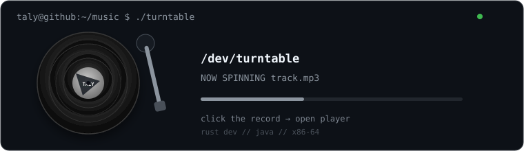

# taly

`rust dev`

i really like computers

```text
systems
reverse engineering
linux
hardware
x86-64
```

<div align="left">
  
  
  
  
  <code>x86-64</code>
</div>

<br>

<a href="https://talystalys.github.io/talystalys/player/">
  
</a>

<sub>click the record to open the player</sub>
